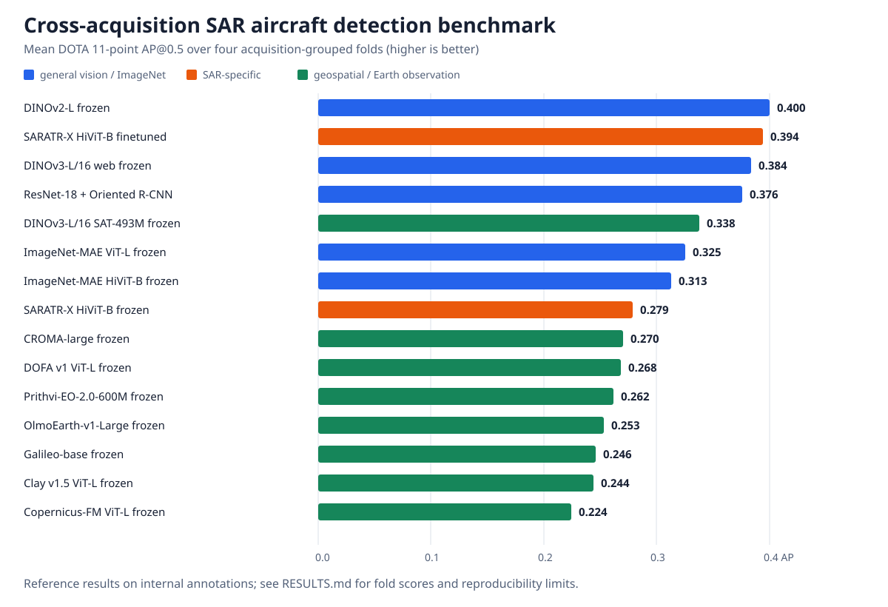

# SAR-GFM-Bench: Foundation Models for SAR Aircraft Detection

[](https://github.com/nikhilmakkar/sar-gfm-bench/actions/workflows/ci.yml)
[](LICENSE)

An open implementation for benchmarking **14 vision, SAR, and geospatial
foundation-model configurations** as backbones for oriented aircraft detection
in high-resolution Umbra synthetic aperture radar (SAR) imagery. It provides a
shared Oriented R-CNN evaluation stack, model wrappers, public-data preparation
tools, and acquisition-grouped cross-validation.

Every encoder is evaluated through the same trainable ViTDet-style adapter,
feature pyramid, and Oriented R-CNN head. The shared input contract is a
three-channel copy of the same 8-bit SAR amplitude image scaled to `[0, 1]`;
model-specific normalization and modality adaptation live in each wrapper.

## Benchmark results



The main finding is that **generic visual pretraining transferred better than
the tested geospatial foundation models** for high-resolution SAR aircraft
detection. Frozen DINOv2-L achieved the highest four-fold mean AP@0.5 (`0.400`),
closely followed by finetuned SARATR-X (`0.394`) and frozen web-pretrained
DINOv3-L (`0.384`). DINOv3-SAT was the strongest frozen geospatial model
(`0.338`). The large variation between acquisitions—especially the difficult
fold 2—also shows why random chip-level splits can overstate performance.

These are DOTA 11-point AP@0.5 reference results, using the best validation AP
over 12 epochs on each of four acquisition-grouped folds. See the complete
[per-fold results and interpretation](RESULTS.md) and the companion article,
[Performance of Geo Foundation Models for Object Detection on High Resolution
SAR Images](https://nikhilmakkar.substack.com/p/performance-of-geo-foundation-models).

## Reproducibility boundary

Umbra Open Data imagery is publicly available under CC BY 4.0. The annotations
and fold membership used for the reported experiments were created internally
and cannot be redistributed. Therefore:

- anyone can download Umbra imagery and run this implementation with their own
  DOTA-format aircraft annotations;
- the exact private-label scores in [RESULTS.md](RESULTS.md) cannot be
  independently reproduced from this repository alone; and
- new scores should identify their imagery selection, annotation protocol, and
  acquisition-grouped split as a separate dataset version.

Read the [companion article](https://nikhilmakkar.substack.com/p/performance-of-geo-foundation-models) for the analysis and conclusions. Start with the end-to-end [data and annotation workflow](docs/DATASET_WORKFLOW.md) to run the code.
It covers public imagery discovery, annotation conventions, DOTA export,
dataset validation, fold generation, and training.

## Included

- Backbone wrappers for DINOv2, DINOv3, MAE ViT, SARATR-X, Clay,
  Copernicus-FM, CROMA, DOFA, Galileo, OlmoEarth, and Prithvi.
- A shared four-level ViTDet adapter emitting strides 8, 16, 32, and 64.
- Oriented R-CNN configs for four-fold cross-acquisition evaluation and an
  in-domain spatial split.
- Portable fold configs controlled by `UMBRA_CV_ROOT`.
- Public-asset downloading, CVAT-to-DOTA conversion, deterministic tiling,
  dataset validation, acquisition-grouped folds, training, evaluation, and
  result-collection utilities.
- CPU shape tests for the shared adapter.
- Aggregate private-label [reference results](RESULTS.md).

No imagery, annotations, pretrained weights, training checkpoints, or raw
experiment logs are included in this repository or its Git history.

## Prepare data

Download scenes from the [Umbra Open Data Program](https://umbra.space/open-data/)
or [AWS Open Data Registry](https://registry.opendata.aws/umbra-open-data/).
Populate the example manifest with the public asset URLs you selected:

```bash
python tools/download_umbra.py examples/umbra_download_manifest.csv data/umbra
```

Annotate those scenes in CVAT using four-point polygons or rotated boxes, then
export a CVAT image-task XML file. The filename is arbitrary and the file is
created by you; this repository does **not** provide `annotations.xml` or any
of the annotations used for the published results. Convert and tile it with:

```bash
python tools/cvat_to_dota.py /path/to/my_cvat_export.xml build/full_scene_labels
python tools/tile_dota_scenes.py \
  data/umbra build/full_scene_labels build/chips \
  --tile-size 512 --overlap 128
```

That creates the runnable dataset layout:

```text
my_chips/
|-- images/
`-- annfiles/
```

Each annotation line is:

```text
x1 y1 x2 y2 x3 y3 x4 y4 aircraft 0
```

Validate the export, then build folds using a `stem,acquisition` CSV:

```bash
python tools/validate_dota_dataset.py build/chips
python tools/make_acquisition_folds.py \
  build/chips build/chips/groups.csv datasets/Umbra/umbra_cv
```

Never randomly separate chips from the same acquisition: doing so leaks nearly
identical scene statistics into both train and validation sets.

## Environment

The benchmark was exercised with Python 3.10, PyTorch 2.0.1 + CUDA 11.8,
MMEngine 0.10.7, MMCV 2.0.1, MMDetection 3.0.0, and MMRotate 1.0.0rc1.
Install the matching PyTorch build first, then:

```bash
python -m pip install openmim
mim install 'mmengine==0.10.7' 'mmcv==2.0.1' 'mmdet==3.0.0' 'mmrotate==1.0.0rc1'
python -m pip install -r requirements.txt
```

GrokSAR is the open-source DenoDet base used by this project. This benchmark
uses a small patch for rotated-box IoU evaluation and standalone DOTA chips.
Install the pinned upstream revision and apply the included patch:

```bash
git clone https://github.com/GrokCV/GrokSAR.git ../GrokSAR
git -C ../GrokSAR checkout 42e4d2e
git -C ../GrokSAR apply "$PWD/patches/groksar-obb-eval.patch"
python -m pip install -e ../GrokSAR
export GROKSAR_ROOT="$(cd ../GrokSAR && pwd)"
```

The patch contains only the OBB evaluation changes used by this benchmark; it
does not contain data or annotations.

Several wrappers use an upstream model repository. Clone only those needed for
your experiments, normally beside this repository:

- DINOv3: <https://github.com/rfaulk/DINO_Soars>
- Clay: <https://github.com/Clay-foundation/model>
- Galileo: <https://github.com/nasaharvest/galileo>
- OlmoEarth: <https://github.com/allenai/olmoearth_pretrain>

Download weights from each model's official release and place them under
`weights/` as referenced by its config. See [MODEL_WEIGHTS.md](MODEL_WEIGHTS.md)
for the exact filenames, sources, code revisions, and SHA-256 values used for
the reported runs. Override repository locations with
`DINOV3_ROOT`, `SARATRX_ROOT`, `CLAY_REPO`, `GALILEO_REPO`, and `OLMO_REPO`.

## Run

Check the shared adapter without downloading model weights:

```bash
python tests/test_adapter.py
```

Point the configs at your generated folds and train one model:

```bash
export UMBRA_CV_ROOT=/absolute/path/to/datasets/Umbra/umbra_cv
python tools/train.py \
  configs/umbra_cv/orcnn_dinov2l_frozen_fold0.py \
  --work-dir work_dirs/dinov2l_fold0
```

Run four folds and collect the best per-fold AP values:

```bash
tools/run_cv.sh dinov2l_frozen
python tools/collect_results.py --work-dir work_dirs
```

## Repository layout

```text
adapters/    shared ViT-to-FPN feature adapter
backbones/   model wrappers and required vendored model components
configs/     portable dataset, detector, schedule, and experiment configs
docs/        dataset creation and annotation guidance
tests/       lightweight checks
tools/       validation, fold creation, training, testing, and aggregation
```

## Licensing and attribution

Original code in this repository is licensed under the
[Apache License 2.0](LICENSE). Vendored third-party components and pretrained
weights remain subject to their upstream licenses; applicable texts and
notices are under `third_party_licenses/`.

Umbra Open Data is not part of this repository. Users who download or publish
derived imagery must comply with Umbra's CC BY 4.0 attribution requirements.
User-created annotations are governed by the license chosen by their creator.

## Citation

For the benchmark implementation, model wrappers, or data-preparation tools,
use GitHub's **Cite this repository** control, which reads
[`CITATION.cff`](CITATION.cff). When discussing the reported results or their
interpretation, cite the companion article and link this repository so readers
can inspect the implementation:

> Makkar, N. “Performance of Geo Foundation Models for Object Detection on
> High Resolution SAR Images.” *Substack*, 2026.
